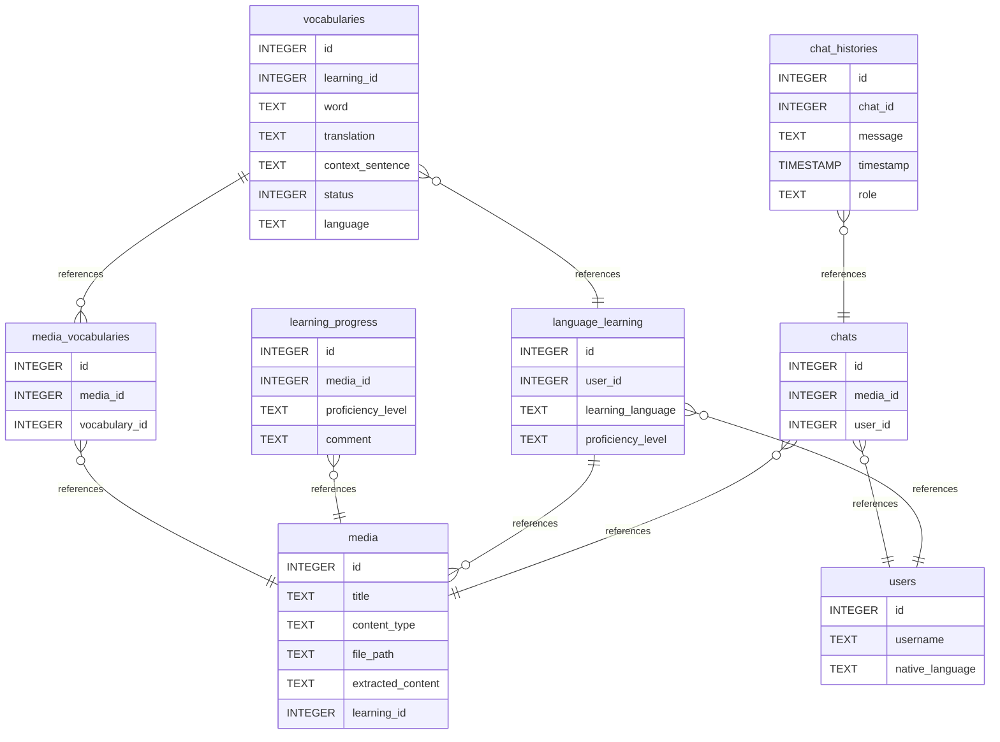

# Immersio-AI

## Description
Eine Anwendung zum Helfen zum Erlernen einer Sprache.
Es wird ein Medium (z.B. Untertitel, Buch, ...) hochgeladen.
Die KI erstellt eine Vokabelliste und hilft mit gesprächen, die Vokabeln zu bewerten und beizubringen.

# Endpoints

## POST Endpoint 1
Endpoint zum Hochladen eines Mediums

## POST Endpoint 2
Endpoint zum Chat der KI

## POST Endpoint 3
Zum Aktualisieren der Vokabellisten

## GET Endpoint 1
Endpoint zum fetchen der Vokabeln

## GET Endpoint 2
Statusrückmeldung zum Lernstand

## Database Requirements
PostgreSQL zum Speichern der Vokabeln und der Konversation
### Database Diagram

