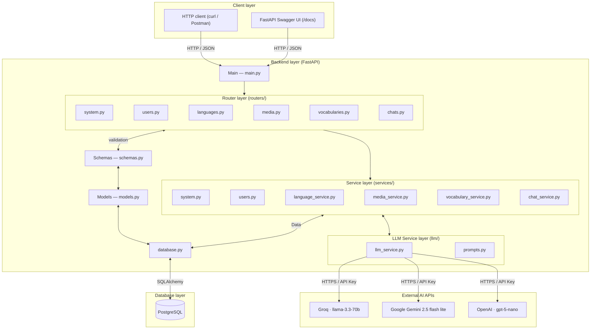
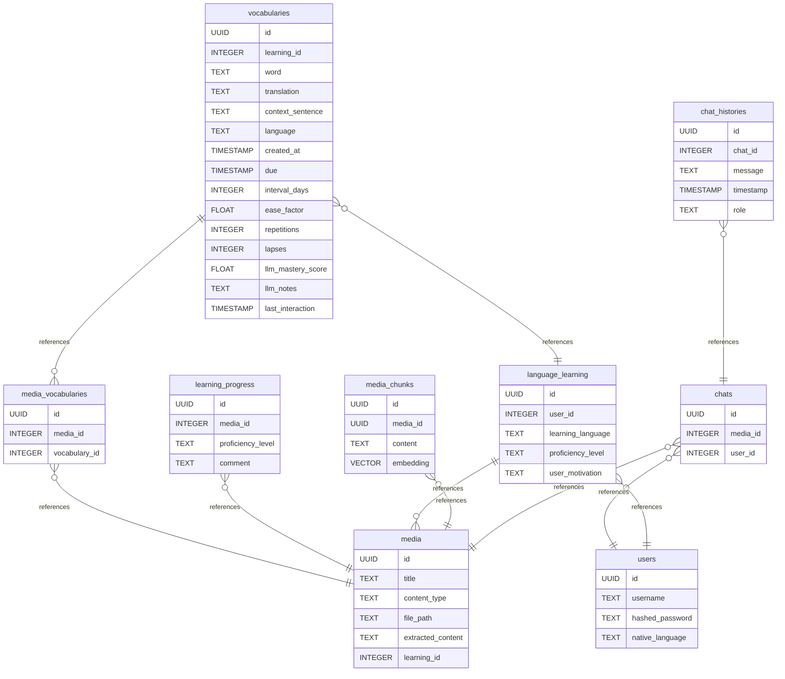

# Dengwa AI

> *From Proto-Indo-European \*dn̥ǵʰwéh₂ (language, tongue) and Japanese 電話 denwa (telephone, literally: electric
speech) — Dengwa AI is a language learning application that meets you where you actually are: reading real content, not
drilling fake sentences.*

Upload subtitles, books, or articles in your target language. Dengwa extracts vocabulary in context, builds your
personal deck, and lets you practice with an AI that knows exactly what you've been reading.

---

## What it does

|                           |                                                          |
|---------------------------|----------------------------------------------------------|
| **Media import**          | Upload SRT, TXT, or documents in your target language    |
| **Vocabulary extraction** | LLM identifies and explains vocabulary in context        |
| **Contextual chat**       | Practice with an AI that knows your vocabulary and media |
| **Multi-LLM support**     | Groq / Gemini / OpenAI — swappable                       |

---

## Endpoints

### System

| Method    | Endpoint  | Description  |
|-----------|-----------|--------------|
| **`GET`** | `/health` | Health check |

### Users

| Method     | Endpoint          | Description             |
|------------|-------------------|-------------------------|
| **`POST`** | `/users/register` | Register a new user     |
| **`POST`** | `/users/login`    | Login user              |
| **`GET`**  | `/users/me`       | Return user information |

### Languages

| Method       | Endpoint                    | Description             |
|--------------|-----------------------------|-------------------------|
| **`GET`**    | `/languages`                | List learning languages |
| **`POST`**   | `/languages`                | Create language         |
| **`GET`**    | `/languages/{lan}`          | Get language info       |
| **`PUT`**    | `/languages/{lan}`          | Update language         |
| **`DELETE`** | `/languages/{lan}`          | Delete language         |
| **`GET`**    | `/languages/{lan}/progress` | Get learning progress   |

### Vocabularies

| Method       | Endpoint             | Description             |
|--------------|----------------------|-------------------------|
| **`GET`**    | `/vocabularies`      | Get vocabulary list     |
| **`POST`**   | `/vocabularies`      | Post new vocabulary     |
| **`GET`**    | `/vocabularies/{id}` | Get vocabulary by ID    |
| **`PUT`**    | `/vocabularies/{id}` | Update vocabulary by ID |
| **`DELETE`** | `/vocabularies/{id}` | Delete vocabulary by ID |

### Media

| Method       | Endpoint                       | Description                       |
|--------------|--------------------------------|-----------------------------------|
| **`POST`**   | `/media`                       | Upload a medium (SRT, TXT)        |
| **`GET`**    | `/media`                       | Get all media for a language      |
| **`GET`**    | `/media/{media_id}`            | Get media by ID                   |
| **`GET`**    | `/media/{media_id}/file`       | Stream the raw file for a medium. |
| **`DELETE`** | `/media/{media_id}`            | Delete media by ID                |
| **`POST`**   | `/media/{media_id}/vocabulary` | Extract vocabulary from medium    |

### Chats

| Method       | Endpoint                 | Description                    |
|--------------|--------------------------|--------------------------------|
| **`GET`**    | `/chats`                 | Get all chats for current user |
| **`POST`**   | `/chats`                 | Create a new chat for a medium |
| **`GET`**    | `/languages/{lan}/chats` | Get all chats for a language   |
| **`GET`**    | `/chats/{chat_id}`       | Get chat history               |
| **`POST`**   | `/chats/{chat_id}`       | Send a message to the AI       |
| **`DELETE`** | `/chats/{chat_id}`       | Delete Chat                    |

---

## Tech Stack

| Component | Technology              |
|-----------|-------------------------|
| Backend   | FastAPI                 |
| Database  | PostgreSQL              |
| LLM 1     | Groq (llama-3.3-70b)    |
| LLM 2     | Gemini (2.5-flash-lite) |
| LLM 3     | OpenAI (gpt-5-nano)     |

---

## Getting Started

### Setup Database:

Install PostgreSQL. Ubuntu example:

```bash
sudo apt install postgresql postgresql-contrib
sudo systemctl start postgresql
sudo systemctl enable postgresql
```

Create Database and start PostgreSQL:

```bash
createdb dengwa_db
psql
```

In PostgreSQL:

```postgresql
ALTER USER postgres WITH PASSWORD 'your_password';
```

### Backend:

```bash
# Install dependencies
pip install -r requirements.txt

# Configure environment
cp .env.example .env
# → Add GROQ_API_KEY and GEMINI_API_KEY

# Run
python main.py
```

### Frontend:

```bash
cd frontend
nvm use 22
pnpm install
pnpm dev
```

## Roadmap

### Done

- [x] Initial project setup (DB, Backend)
- [x] SQLAlchemy models & Pydantic schemas
- [x] LLM integration (Groq/Gemini/OpenAI)
- [x] POST endpoints (languages, media, chats, vocabularies)
- [x] Media processing (SRT, TXT parsing)
- [x] LLM integration in chat (conversation history from DB)
- [x] Vocabulary CRUD endpoints
- [x] Vocabulary generation from media via LLM
- [x] Language endpoints (CRUD)
- [x] Full CRUD for media, chats, languages
- [x] Code refactoring (routers/, llm/, services/ structure)
- [x] Architecture diagrams (Mermaid)
- [x] Switch to LangGraph as AI wrapper
- [x] JWT authentication (login/register)
- [x] UUID instead of serial ID for endpoints
- [x] Frontend setup (React 18 + Vite + TypeScript + Tailwind + shadcn/ui)
- [x] Media upload & management
- [x] Add Docker Image
- [x] Added Tests (pytest)
- [x] Multiple Language UI with i18n
- [x] Translate UI
- [x] Return file endpoint and show in frontend


### Backend

- [ ] RAG — inject vocabulary context into chat prompts (pgvector)
- [ ] Progress endpoint — implement actual logic (currently stub)
- [ ] Add default Vocab starter set (HSK, JLPT, ...)
- [ ] Other Media Parsing
- [ ] Alembic
- [ ] Add License

### Frontend

- [ ] Add Flags
- [ ] Comparison of LLMs

## Architecture

### Backend



---

## Database

### Diagram

