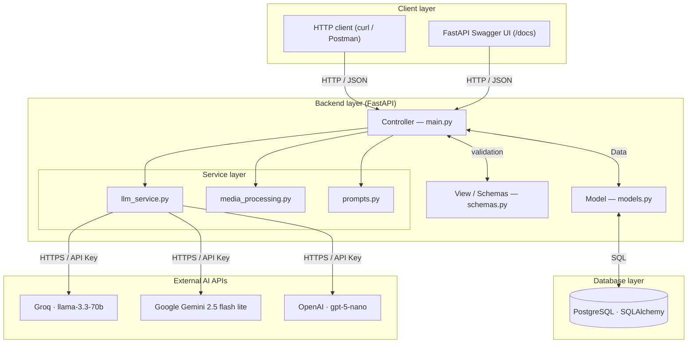
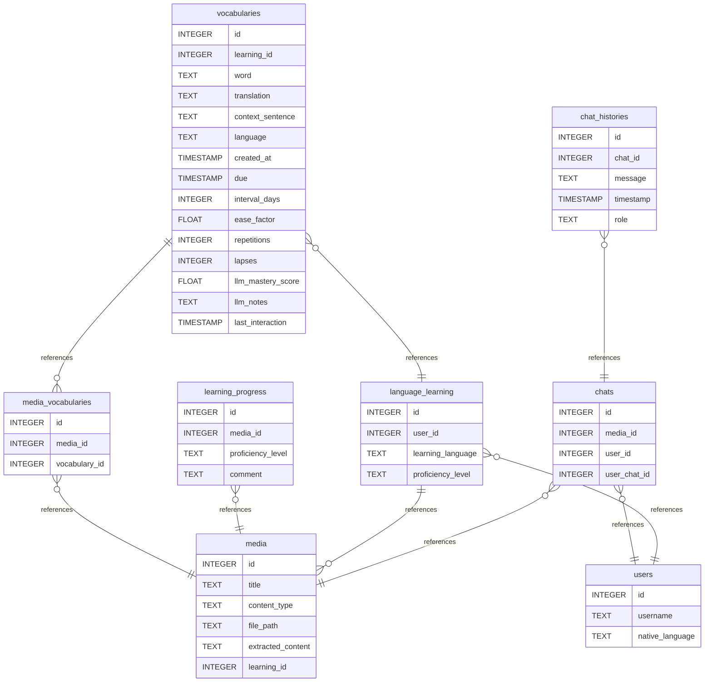

# Immersio AI

A language learning application powered by AI.
Upload a medium (e.g. subtitles, books, text files) and the AI will extract vocabulary, help you learn it through
conversation, and track your progress.

---

## Endpoints

### System

| Method     | Endpoint    | Description         |
|------------|-------------|---------------------|
| **`GET`**  | `/health`   | Health check        |
| **`POST`** | `/register` | Register a new user |

### Languages

| Method       | Endpoint                    | Description             |
|--------------|-----------------------------|-------------------------|
| **`GET`**    | `/languages`                | List learning languages |
| **`POST`**   | `/languages`                | Create language         |
| **`GET`**    | `/languages/{lan}`          | Get language info       |
| **`PUT`**    | `/languages/{lan}`          | Update language         |
| **`DELETE`** | `/languages/{lan}`          | Delete language         |
| **`GET`**    | `/languages/{lan}/progress` | Get learning progress   |

### Vocabularies

| Method       | Endpoint             | Description             |
|--------------|----------------------|-------------------------|
| **`GET`**    | `/vocabularies`      | Get vocabulary list     |
| **`POST`**   | `/vocabularies`      | Post new vocabulary     |
| **`GET`**    | `/vocabularies/{id}` | Get vocabulary by ID    |
| **`PUT`**    | `/vocabularies/{id}` | Update vocabulary by ID |
| **`DELETE`** | `/vocabularies/{id}` | Delete vocabulary by ID |

### Media

| Method       | Endpoint                       | Description                    |
|--------------|--------------------------------|--------------------------------|
| **`POST`**   | `/media`                       | Upload a medium (SRT, TXT)     |
| **`GET`**    | `/media`                       | Get all media for a language   |
| **`GET`**    | `/media/{media_id}`            | Get media by ID                |
| **`DELETE`** | `/media/{media_id}`            | Delete media by ID             |
| **`POST`**   | `/media/{media_id}/vocabulary` | Extract vocabulary from medium |

### Chats

| Method       | Endpoint                 | Description                    |
|--------------|--------------------------|--------------------------------|
| **`GET`**    | `/chats`                 | Get all chats for current user |
| **`POST`**   | `/chats`                 | Create a new chat for a medium |
| **`GET`**    | `/languages/{lan}/chats` | Get all chats for a language   |
| **`GET`**    | `/chats/{chat_id}`       | Get chat history               |
| **`POST`**   | `/chats/{chat_id}`       | Send a message to the AI       |
| **`DELETE`** | `/chats/{chat_id}`       | Delete Chat                    |

---

## Tech Stack

| Component | Technology              |
|-----------|-------------------------|
| Backend   | FastAPI                 |
| Database  | PostgreSQL              |
| LLM 1     | Groq (llama-3.3-70b)    |
| LLM 2     | Gemini (2.5-flash-lite) |
| LLM 3     | OpenAI (gpt-5-nano)     |

---

## Getting Started

### Setup Database:

Install PostgreSQL. Ubuntu example:

```bash
sudo apt install postgresql postgresql-contrib
sudo systemctl start postgresql
sudo systemctl enable postgresql
```

Create Database and start PostgreSQL:

```bash
createdb immersio_db
psql
```

In PostgreSQL:

```postgresql
ALTER USER postgres WITH PASSWORD 'your_password';
```

### Install requirements and start:

```bash
# Install dependencies
pip install -r requirements.txt

# Configure environment
cp .env.example .env
# → Add GROQ_API_KEY and GEMINI_API_KEY

# Run
python main.py
```

## Roadmap

- [ ] RAG — inject vocabulary context into chat prompts
- [ ] Switch to langraph as AI wrapper
- [ ] Progress endpoint — implement actual logic (currently stub)
- [ ] JWT login/register endpoints
- [ ] Replace `get_current_user()` stub with real auth dependency
- [ ] Add default Vocab starter set (HSK, JLPT, ...)
- [ ] Docker Deployment
- [ ] Tests (pytest)
- [ ] Refactor Code
- [ ] Add Frontend

## Architecture



---

## Database

### Diagram

