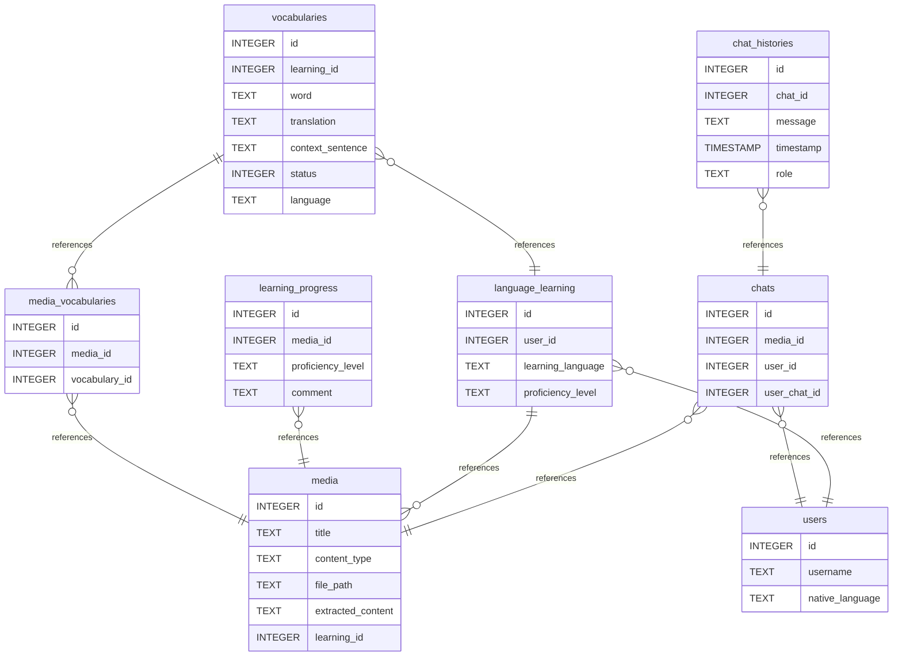

# Immersio AI

A language learning application powered by AI.
Upload a medium (e.g. subtitles, books, text files) and the AI will extract vocabulary, help you learn it through
conversation, and track your progress.

---

## Endpoints

| Method  | Endpoint                             | Description                    |
|---------|--------------------------------------|--------------------------------|
| `GET`   | `/health`                            | Health check                   |
| `POST`  | `/languages/{lan}/media`             | Upload a medium (SRT, TXT)     |
| `GET`   | `/languages/{lan}/media`             | Get all media for a language   |
| `GET`   | `/languages/{lan}/vocabularies`      | Get vocabulary list            |
| `PATCH` | `/languages/{lan}/vocabularies/{id}` | Update vocabulary status       |
| `GET`   | `/languages/{lan}/chats`             | Get all chats for a language   |
| `GET`   | `/languages/{lan}/progress`          | Get learning progress          |
| `POST`  | `/media/{media_id}/chats`            | Create a new chat for a medium |
| `GET`   | `/chats`                             | Get all chats for current user |
| `GET`   | `/chats/{chat_id}`                   | Get chat history               |
| `POST`  | `/chats/{chat_id}`                   | Send a message to the AI       |

---

## Tech Stack

| Component | Technology              |
|-----------|-------------------------|
| Backend   | FastAPI                 |
| Database  | PostgreSQL              |
| LLM 1     | Groq (llama-3.3-70b)    |
| LLM 2     | Gemini (2.5-flash-lite) |
| LLM 3     | OpenAI (gpt-5-nano)     |

---

## Database

### Diagram



---

## Getting Started

### Setup Database:

Install PostgreSQL. Ubuntu example:

```bash
sudo apt install postgresql postgresql-contrib
sudo systemctl start postgresql
sudo systemctl enable postgresql
```

Create Database and start PostgreSQL:

```bash
createdb immersio_db
psql
```

In PostgreSQL:

```postgresql
ALTER USER postgres WITH PASSWORD 'your_password';
```

### Install requirements and start:

```bash
# Install dependencies
pip install -r requirements.txt

# Configure environment
cp .env.example .env
# → Add GROQ_API_KEY and GEMINI_API_KEY

# Run
python main.py
```

## Roadmap
- Integrate AI to Endpoints
- Add Tests
- Deploy with Docker