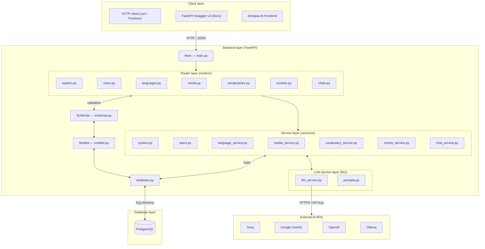
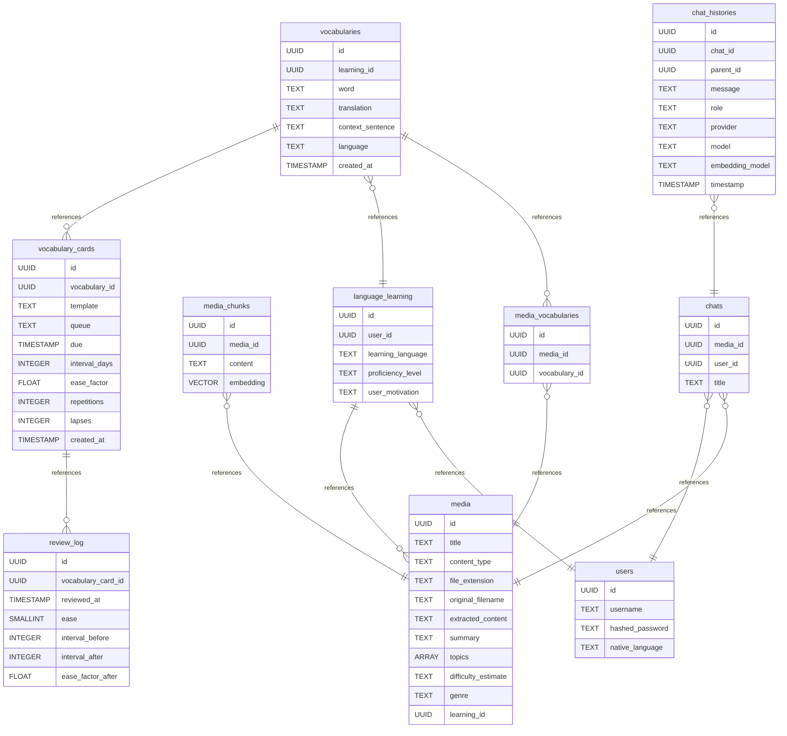

# Dengwa AI


> *From Proto-Indo-European \*dn̥ǵʰwéh₂ (language, tongue) and Japanese 電話 denwa (telephone, literally: electric
speech) — Dengwa AI is a language learning application that meets you where you actually are: reading real content, not
drilling fake sentences.*

Upload subtitles, books, or articles in your target language. Dengwa extracts vocabulary in context, builds your
personal deck, and lets you practice with an AI that knows exactly what you've been reading.

---

## What it does

| You can...                 | With Dengwa...                                                      |
|----------------------------|---------------------------------------------------------------------|
| 📺 Learn from subtitles    | Upload SRT files and extract vocabulary automatically               |
| 📚 Read books              | Build vocabulary directly from what you read                        |
| 💬 Chat about your content | The AI remembers your media and vocabulary                          |
| 🧠 Review efficiently      | Built-in spaced repetition keeps words fresh                        |
| 🗣 Practice speaking       | Integrated TTS and STT support pronunciation practice               |
| 🤖 Choose your AI          | Use OpenAI today and Ollama tomorrow without changing your workflow |

---

## Tech Stack

| Component  | Technology                              |
|------------|-----------------------------------------|
| Backend    | FastAPI                                 |
| Database   | PostgreSQL with pgvector                |
| Frontend   | React 19 + Vite + TypeScript + Tailwind |
| LLMs       | OpenAI · Gemini · Groq · Ollama         |
| Deployment | Docker                                  |

---

## Getting Started

### Docker:

```bash
docker compose up -d --build

# Configure environment
cp .env.example .env
# → Set DATABASE_URL, GROQ_API_KEY, GEMINI_API_KEY, etc.
```

### Manual:

#### Setup Database:

Install PostgreSQL. Ubuntu example:

```bash
sudo apt install postgresql postgresql-contrib
sudo systemctl start postgresql
sudo systemctl enable postgresql
```

Create Database and start PostgreSQL:

```bash
createdb dengwa_db
psql -d dengwa_db -c "CREATE EXTENSION IF NOT EXISTS vector;"
```

In PostgreSQL:

```postgresql
ALTER USER postgres WITH PASSWORD 'your_password';
```

#### Backend:

```bash
# Install dependencies
pip install -r requirements.txt

# Configure environment
cp .env.example .env
# → Set DATABASE_URL, GROQ_API_KEY, GEMINI_API_KEY, etc.

# Run
python main.py
```

#### Frontend:

```bash
cd frontend
nvm use 22
pnpm install
pnpm dev
```

## Roadmap

<details>

<summary>Completed milestones</summary>

- [x] Initial project setup (DB, Backend)
- [x] SQLAlchemy models & Pydantic schemas
- [x] LLM integration (Groq/Gemini/OpenAI)
- [x] POST endpoints (languages, media, chats, vocabularies)
- [x] Media processing (SRT, TXT parsing)
- [x] LLM integration in chat (conversation history from DB)
- [x] Vocabulary CRUD endpoints
- [x] Vocabulary generation from media via LLM
- [x] Language endpoints (CRUD)
- [x] Full CRUD for media, chats, languages
- [x] Code refactoring (routers/, llm/, services/ structure)
- [x] Architecture diagrams (Mermaid)
- [x] Switch to LangChain as AI wrapper
- [x] JWT authentication (login/register)
- [x] UUID instead of serial ID for endpoints
- [x] Frontend setup (React 18 + Vite + TypeScript + Tailwind + shadcn/ui)
- [x] Media upload & management
- [x] Add Docker Image
- [x] Added Tests (pytest)
- [x] Multiple Language UI with i18n
- [x] Translate UI
- [x] Return file endpoint and show in frontend
- [x] RAG — inject vocabulary context into chat prompts (pgvector)
- [x] Add Chat branching
- [x] Comparison of LLMs
- [x] Spaced Repetition System (SRS)
- [x] PWA
- [x] Added Message Streaming
- [x] TTS & STT
- [x] Added Games
- [x] TTS for all components

</details>

### Backend

- [ ] Add default Vocab starter set (HSK, JLPT, ...)
- [ ] Other Media Parsing
- [ ] Add Multiple Choice & Free text entry to SRS
- [ ] LiteLLM as LLM wrapper
- [ ] Add LLM API Keys for users
- [ ] Monitoring Token
- [ ] Alembic
- [ ] Add License
- [ ] Anki Compatibility

### Frontend

- [ ] Add more Games
- [ ] Try WebLLM
- [ ] Big uploads in background
- [ ] Progress visualization
- [ ] Error handling
- [ ] Responsive design
- [ ] PWA offline features

## Architecture

### Backend


```mermaid
graph TB
    subgraph Client["Client layer"]
        HTTP["HTTP client (curl / Postman)"]
        Swagger["FastAPI Swagger UI (/docs)"]
        Frontend["Dengwa AI Frontend"]
        HTTP ~~~ Swagger ~~~ Frontend
    end

    subgraph Backend["Backend layer (FastAPI)"]
        Controller["Main — main.py"]
        Schemas["Schemas — schemas.py"]
        Models["Models — models.py"]
        Database["database.py"]

        subgraph Routers["Router layer (routers/)"]
            direction LR
            SystemRouter["system.py"]
            UserRouter["users.py"]
            LanguageRouter["languages.py"]
            MediaRouter["media.py"]
            VocabRouter["vocabularies.py"]
            ReviewRouter["reviews.py"]
            ChatRouter["chats.py"]
            SystemRouter ~~~ UserRouter
            UserRouter ~~~ LanguageRouter
            LanguageRouter ~~~ MediaRouter
            MediaRouter ~~~ VocabRouter
            VocabRouter ~~~ ReviewRouter
            ReviewRouter ~~~ ChatRouter
        end

        subgraph Services["Service layer (services/)"]
            direction LR
            System["system.py"]
            Users["users.py"]
            Language["language_service.py"]
            Media["media_service.py"]
            Vocab["vocabulary_service.py"]
            Review["review_service.py"]
            Chat["chat_service.py"]
            System ~~~ Users
            Users ~~~ Language
            Language ~~~ Media
            Media ~~~ Vocab
            Vocab ~~~ Review
            Review ~~~ Chat
        end
        subgraph LLMServices["LLM Service layer (llm/)"]
            LLM["llm_service.py"]
            Prompts["prompts.py"]
        end

        Controller --> Routers
        Routers <-->|validation| Schemas
        Services <-->|Data| Database
        Routers --> Services
        Services <--> LLMServices
    end

    subgraph DB["Database layer"]
        Postgres[("PostgreSQL")]
    end

    subgraph AI["External AI APIs"]
        Groq["Groq"]
        Gemini["Google Gemini"]
        OpenAI["OpenAI"]
        Ollama["Ollama"]
        Groq ~~~ Gemini ~~~ OpenAI ~~~ Ollama
    end

    Client -->|HTTP / JSON| Controller
    LLM -->|HTTPS / API Key| AI
    Schemas <--> Models
    Models <--> Database
    Database <-->|SQLAlchemy| Postgres


```

---

## Database

### Diagram


```mermaid
erDiagram
    chat_histories }o--|| chats: references
    chats }o--|| media: references
    media_chunks }o--|| media: references
    language_learning }o--|| users: references
    language_learning ||--o{ media: references
    media_vocabularies }o--|| media: references
    vocabularies ||--o{ media_vocabularies: references
    vocabularies }o--|| language_learning: references
    vocabularies ||--o{ vocabulary_cards: references
    vocabulary_cards ||--o{ review_log: references
    chats }o--|| users: references

    users {
        UUID id
        TEXT username
        TEXT hashed_password
        TEXT native_language
    }

    media {
        UUID id
        TEXT title
        TEXT content_type
        TEXT file_extension
        TEXT original_filename
        TEXT extracted_content
        TEXT summary
        ARRAY topics
        TEXT difficulty_estimate
        TEXT genre
        UUID learning_id
    }
    media_chunks {
        UUID id
        UUID media_id
        TEXT content
        VECTOR embedding
    }

    vocabularies {
        UUID id
        UUID learning_id
        TEXT word
        TEXT translation
        TEXT context_sentence
        TEXT language
        TIMESTAMP created_at
    }

    vocabulary_cards {
        UUID id
        UUID vocabulary_id
        TEXT template
        TEXT queue
        TIMESTAMP due
        INTEGER interval_days
        FLOAT ease_factor
        INTEGER repetitions
        INTEGER lapses
        TIMESTAMP created_at
    }

    review_log {
        UUID id
        UUID vocabulary_card_id
        TIMESTAMP reviewed_at
        SMALLINT ease
        INTEGER interval_before
        INTEGER interval_after
        FLOAT ease_factor_after
    }

    chats {
        UUID id
        UUID media_id
        UUID user_id
        TEXT title
    }

    chat_histories {
        UUID id
        UUID chat_id
        UUID parent_id
        TEXT message
        TEXT role
        TEXT provider
        TEXT model
        TEXT embedding_model
        TIMESTAMP timestamp
    }

    language_learning {
        UUID id
        UUID user_id
        TEXT learning_language
        TEXT proficiency_level
        TEXT user_motivation
    }

    media_vocabularies {
        UUID id
        UUID media_id
        UUID vocabulary_id
    }

```

---

## Endpoints

### System

| Method    | Endpoint  | Description  |
|-----------|-----------|--------------|
| **`GET`** | `/health` | Health check |

### Users

| Method     | Endpoint          | Description             |
|------------|-------------------|-------------------------|
| **`POST`** | `/users/register` | Register a new user     |
| **`POST`** | `/users/login`    | Login user              |
| **`GET`**  | `/users/me`       | Return user information |

### Languages

| Method       | Endpoint           | Description             |
|--------------|--------------------|-------------------------|
| **`GET`**    | `/languages`       | List learning languages |
| **`POST`**   | `/languages`       | Create language         |
| **`GET`**    | `/languages/{lan}` | Get language info       |
| **`PUT`**    | `/languages/{lan}` | Update language         |
| **`DELETE`** | `/languages/{lan}` | Delete language         |

### Vocabularies

| Method       | Endpoint             | Description             |
|--------------|----------------------|-------------------------|
| **`GET`**    | `/vocabularies`      | Get vocabulary list     |
| **`POST`**   | `/vocabularies`      | Post new vocabulary     |
| **`GET`**    | `/vocabularies/{id}` | Get vocabulary by ID    |
| **`PUT`**    | `/vocabularies/{id}` | Update vocabulary by ID |
| **`DELETE`** | `/vocabularies/{id}` | Delete vocabulary by ID |

### Media

| Method       | Endpoint                       | Description                       |
|--------------|--------------------------------|-----------------------------------|
| **`POST`**   | `/media`                       | Upload a medium (SRT, TXT)        |
| **`GET`**    | `/media`                       | Get all media for a language      |
| **`GET`**    | `/media/{media_id}`            | Get media by ID                   |
| **`GET`**    | `/media/{media_id}/file`       | Stream the raw file for a medium. |
| **`DELETE`** | `/media/{media_id}`            | Delete media by ID                |
| **`POST`**   | `/media/{media_id}/vocabulary` | Extract vocabulary from medium    |

### Chats

| Method       | Endpoint                                        | Description                                 |
|--------------|-------------------------------------------------|---------------------------------------------|
| **`GET`**    | `/chats`                                        | Get all chats for current user              |
| **`POST`**   | `/chats`                                        | Create a new chat for a medium              |
| **`GET`**    | `/chats/{chat_id}`                              | Get chat history                            |
| **`POST`**   | `/chats/{chat_id}`                              | Send a message to the AI and receive answer |
| **`POST`**   | `/chats/{chat_id}/stream`                       | Send a message to the AI and receive stream |
| **`PUT`**    | `/chats/{chat_id}`                              | Updates Chat Info                           |
| **`DELETE`** | `/chats/{chat_id}`                              | Delete Chat                                 |
| **`POST`**   | `/chats/{chat_id}/messages/{message_id}`        | Create a response for a message             |
| **`POST`**   | `/chats/{chat_id}/messages/{message_id}/stream` | Stream a response for a message             |
| **`POST`**   | `/chats/{chat_id}/write`                        | Inject a message to the DB                  |

### Reviews

| Method     | Endpoint             | Description         |
|------------|----------------------|---------------------|
| **`GET`**  | `/reviews/next`      | Get next review     |
| **`POST`** | `/reviews/{card_id}` | Submit review       |
| **`GET`**  | `/reviews/count`     | Get review count    |
| **`GET`**  | `/reviews/stats`     | Get review stats    |
| **`GET`**  | `/reviews/timeline`  | Get review timeline |

### LLM Models

| Method    | Endpoint                | Description             |
|-----------|-------------------------|-------------------------|
| **`GET`** | `/llm_models/chat`      | Get chat providers      |
| **`GET`** | `/llm_models/embedding` | Get embedding providers |
